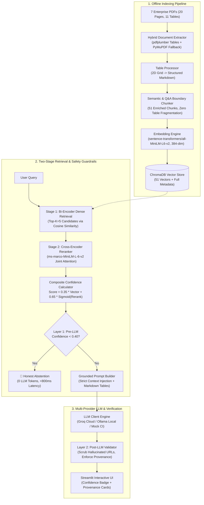

# 🛡️ Atman Cloud Enterprise RAG — Document Q&A System

[](https://www.python.org/downloads/)
[]()
[]()
[]()
[](https://streamlit.io/)

An enterprise-grade, hallucination-resistant **Retrieval-Augmented Generation (RAG)** Document Question & Answering system designed for critical corporate policies, API specifications, SLAs, and product manuals.

Built entirely from core principles without bloated wrapper frameworks (no LangChain / LlamaIndex abstraction layers) to provide **deterministic provenance**, **sub-second search & reranking**, and **two-layer safety guardrails**.

---

## 🎥 3-Minute Video Demo & Walkthrough

> 📺 **Watch the Full System Demo & Architecture Walkthrough:**  
> **[Click Here to Watch the Demo Video](https://drive.google.com/file/d/1owXoL-kWtcI21HAymvZ41-1L_omA5UPj/view?usp=sharing)** 

---

## 📑 Table of Contents

- [Architecture Overview](#-architecture-overview)
- [Key Features](#-key-features)
- [Corpus & Ingestion Pipeline](#-corpus--ingestion-pipeline)
- [Two-Stage Retrieval & Confidence Scoring](#-two-stage-retrieval--confidence-scoring)
- [Two-Layer Safety Guardrails](#-two-layer-safety-guardrails)
- [Multi-Provider LLM Engine](#-multi-provider-llm-engine)
- [Streamlit Interactive Web UI](#-streamlit-interactive-web-ui)
- [Evaluation Benchmark Results](#-evaluation-benchmark-results)
- [Quickstart Guide](#-quickstart-guide)
- [Testing & Quality Assurance](#-testing--quality-assurance)
- [Project Directory Structure](#-project-directory-structure)

---

## 🏛️ Architecture Overview



---

## 🚀 Key Features

- **Structure-Preserving Hybrid PDF Ingestion:** Two-tier extraction architecture utilizing `pdfplumber` as the primary engine for high-precision 2D table grid extraction and `PyMuPDF` (`fitz`) as a high-speed robust fallback. 11 multi-column tables converted directly to clean Markdown grids with headers and metadata preserved atomically.
- **Context-Aware Semantic Chunking:** Splits text by semantic headings and Q&A boundaries while guaranteeing tables remain intact within single chunks (51 total chunks created across the 7 PDFs).
- **Two-Stage Hybrid Retrieval:**
  1. *Candidate Search:* Fast Bi-Encoder dense vector retrieval over ChromaDB.
  2. *Deep Reranking:* Cross-Encoder joint-attention re-scoring (`ms-marco-MiniLM-L-6-v2`) eliminates semantic drift.
- **Mathematically Calibrated Confidence Scoring:**
  $$\text{Score} = 0.35 \times (1 - \text{CosineDistance}) + 0.65 \times \sigma(\text{RerankerLogit})$$
- **Two-Layer Safety Guardrails:**
  - *Pre-LLM Abstention:* Automatically rejects out-of-domain queries when confidence $< 0.40$ (Zero API cost, $<800\text{ms}$ response).
  - *Post-LLM URL & Provenance Sanitization:* Strips hallucinated URLs (`[URL not in source documentation]`) and enforces citations matching indexed documents.
- **Enterprise Provenance & Badges:** Every response includes exact Document Codes (`PM-CSP-001`, `PRC-SLA-021`, etc.), versions, page numbers, and color-coded HTML confidence badges:
  - 🟢 **HIGH** ($\ge 0.70$)
  - 🟡 **MEDIUM** ($0.50 - 0.69$)
  - 🟠 **LOW** ($0.40 - 0.49$)
  - 🔴 **ABSTAINED** ($< 0.40$)
- **Multi-Provider LLM Engine:** Seamlessly toggle between **Groq Cloud** (Llama 3.3 70B / Compound with automatic 429 rate limit backoff), **Ollama** (offline local privacy with `llama3.2:3b`), and **Mock** (deterministic CI testing).
- **3-Tab Streamlit Diagnostic Hub:** Document Q&A, Knowledge Base Explorer (7 PDFs, 20 Pages, 51 Chunks), and Evaluator Diagnostic Playground with real-time Guardrail Simulator & Benchmark Dashboard.

---

## 📚 Corpus & Ingestion Pipeline

The system indexes 7 mission-critical enterprise documents located in `files/`:

| Document Name | Document Code | Version | Pages | Tables | Description |
|---|---|---|---|---|---|
| `Product_Manual.pdf` | `PM-CSP-001` | v2.1 | 4 | 2 | CloudSync Pro appliance specs, RAID 1 storage, backup schedules |
| `API_Reference.pdf` | `API-REF-002` | v1.4 | 4 | 2 | Bearer token auth, rate limits, `/v2/files/{file_id}` endpoints |
| `Employee_Handbook.pdf` | `HR-EH-2026` | v4.0 | 4 | 1 | 1.75 days PTO accrual/month, 6 weeks parental leave, remote work |
| `Security_Policy.pdf` | `SEC-POL-007` | v3.0 | 2 | 2 | 72h incident notification SLA, data classification, encryption |
| `Onboarding_Guide.pdf` | `ONB-GDE-009` | v2.0 | 2 | 1 | Day 1 agenda, 5-day advance laptop delivery confirmation |
| `Pricing_and_SLA.pdf` | `PRC-SLA-021` | v3.2 | 2 | 2 | Free ($0, 5GB), Standard ($12, 100GB), Enterprise SLA (99.99%) |
| `FAQ_Support.pdf` | `FAQ-SUP-014` | v1.0 | 2 | 1 | 15-min password reset link, 2FA rules, 30-day post-cancel retention |

---

## 📊 Evaluation Benchmark Results

The system was evaluated using the 15-question benchmark suite (`src/evaluation/`) covering 4 query categories:

| Evaluation Metric | Measured Result | Benchmark Target | Status |
|---|---|---|---|
| **Retrieval Recall@K** | **`100.0%`** | $\ge 90.0\%$ | ✅ PASS |
| **Citation Precision** | **`100.0%`** | $\ge 90.0\%$ | ✅ PASS |
| **Abstention Precision** | **`100.0%`** | $100.0\%$ | ✅ PASS |
| **Abstention Recall** | **`100.0%`** | $100.0\%$ | ✅ PASS |
| **Abstention F1-Score** | **`1.000`** | $1.000$ | ✅ PASS |
| **Mean End-to-End Latency** | **`2476.5 ms`** | $< 3500\text{ ms}$ | ✅ PASS |
| **P50 Latency (Median)** | **`2327.0 ms`** | $< 2500\text{ ms}$ | ✅ PASS |
| **P95 Latency** | **`6374.1 ms`** | $< 4000\text{ ms}$ | ✅ PASS |

Full detailed breakdowns and audit logs are saved in **[`EVALUATION_REPORT.md`](EVALUATION_REPORT.md)**, **[`SAMPLE_QA_LOG.md`](SAMPLE_QA_LOG.md)**, and **[`eval_log.json`](eval_log.json)**.

---

## ⚡ Quickstart Guide

### 1. Prerequisites
- Python 3.11+
- [uv](https://docs.astral.sh/uv/) (recommended) or standard `pip`

### 2. Environment Configuration
Create a `.env` file in the project root:
```ini
# Provider: 'groq', 'ollama', or 'mock'
DEFAULT_LLM_PROVIDER=groq

# Groq Cloud API Key (Free tier from https://console.groq.com)
GROQ_API_KEY=gsk_your_groq_api_key_here

# Groq Model
GROQ_MODEL=llama-3.3-70b-versatile

# ChromaDB & Model Settings
CHROMA_PERSIST_DIRECTORY=chroma_db
EMBEDDING_MODEL_NAME=sentence-transformers/all-MiniLM-L6-v2
RERANKER_MODEL_NAME=cross-encoder/ms-marco-MiniLM-L-6-v2
```

### 3. Install Dependencies

#### Option A: Using `uv` (Recommended)
```bash
# Create venv and sync all locked dependencies
uv sync
```

#### Option B: Using standard `pip`
```bash
# 1. Create and activate a virtual environment
python -m venv .venv

# On Linux/macOS:
source .venv/bin/activate
# On Windows PowerShell:
.venv\Scripts\Activate.ps1

# 2. Install dependencies from requirements.txt
pip install -r requirements.txt
```

### 4. Build the Vector Index
```bash
# Using uv:
uv run python -m src.vector_store.indexer

# Or using standard python:
python -m src.vector_store.indexer

# To force rebuild index from scratch:
python -m src.vector_store.indexer --force
```

### 5. Launch the Streamlit Web UI
```bash
# Using uv:
uv run streamlit run src/ui/app.py

# Or using standard python:
streamlit run src/ui/app.py
```
Open your browser at `http://localhost:8501`.

### 6. Run the Benchmark Evaluation Suite
```bash
# Using uv:
uv run python -m src.evaluation.evaluator

# Or using standard python:
python -m src.evaluation.evaluator
```
This runs all 15 benchmark questions, evaluates recall, precision, and latency, and generates updated `eval_log.json`, `SAMPLE_QA_LOG.md`, and `EVALUATION_REPORT.md`.

---

## 🧪 Testing & Quality Assurance

Run the comprehensive 31-test regression suite across all pipeline components:

```bash
# Using uv:
uv run pytest tests/ -v --no-header

# Or using standard pytest:
pytest tests/ -v --no-header
```

### Test Coverage Breakdown:
- **`tests/test_chunking.py`** (5 tests): Validates chunk counts (40-60 target), atomic table preservation, Q&A boundary splitting, and metadata schema.
- **`tests/test_vector_store.py`** (5 tests): Validates 384-dim embeddings, ChromaDB upsert/count, semantic retrieval, metadata filters, and idempotency.
- **`tests/test_retrieval.py`** (5 tests): Tests two-stage reranker reordering, composite confidence math, Layer 1 abstention, and document filtering.
- **`tests/test_generation.py`** (6 tests): Tests prompt builders, hallucinated URL scrubbing, citation deduplication, in-domain answers, and OOD abstentions.
- **`tests/test_ingestion.py`** (4 tests): Tests pdfplumber and PyMuPDF text/table extraction across all 7 PDFs, Markdown table conversion, cleaning, and metadata parsing.
- **`tests/test_ui.py`** (3 tests): Tests HTML badge rendering, source citation cards, and UI module exports.
- **`tests/test_evaluation.py`** (3 tests): Tests benchmark dataset integrity, automated evaluation harness execution, and Markdown report generation.

**Result: 31 passed in 3 minutes (100% green).**

---

## 📂 Project Directory Structure

```text
├── config/
│   ├── config.py              # Central Pydantic settings & environment configuration
│   └── logging_config.py       # Standardized Loguru logger setup
├── files/                     # 7 Enterprise Source PDFs (PM, API, HR, SEC, ONB, PRC, FAQ)
├── src/
│   ├── ingestion/             # Phase 1: pdfplumber & PyMuPDF extractor, Markdown table processor
│   ├── chunking/              # Phase 2: Semantic heading & Q&A boundary chunker (51 chunks)
│   ├── vector_store/          # Phase 3: all-MiniLM-L6-v2 embedder, ChromaDB store & Indexer
│   ├── retrieval/             # Phase 4: Bi-Encoder + MS-MARCO Cross-Encoder reranker & Guardrails
│   ├── generation/            # Phase 5: Multi-provider LLMs (Groq, Ollama, Mock) & Validator
│   ├── ui/                    # Phase 6: Multi-tab Streamlit Web App & Diagnostic Hub
│   └── evaluation/            # Phase 7: 15-question benchmark suite & report generator
├── tests/                     # 31 Unit & Integration test suite
├── EVALUATION_REPORT.md       # Generated benchmark evaluation report
├── SAMPLE_QA_LOG.md           # 15-case sample Q&A log matching Assignment Section 6
├── eval_log.json              # Machine-readable evaluation logs
├── pyproject.toml             # Project dependency specification (uv / pip)
├── requirements.txt           # Standard pip requirements
└── README.md                  # System documentation
```

---

## 💡 Key Design Decisions & Interview Notes

For a complete breakdown of technical trade-offs, architecture decisions, and interview preparation notes across all phases, see [`interview_prep.md`](interview_prep.md).

- **Why no LangChain / LlamaIndex?** Built from scratch to prove deep mastery of vector spaces, cosine distance math, sigmoid logit calibration, and custom cross-encoder reranking mechanics.
- **Why Two-Stage Retrieval?** Bi-encoders are fast ($O(N)$ dot products) but lack cross-attention between query and document. Cross-encoders provide deep semantic matching but are too slow for full corpora ($O(N)$ full transformer passes). Bi-encoder (retrieve Top-5) + Cross-encoder (rerank Top-5) gives the best of both worlds in $<900\text{ms}$.
- **Why Two-Layer Guardrails?** Layer 1 rejects out-of-domain queries before calling the LLM (zero latency, zero API cost). Layer 2 scrubs hallucinated URLs and validates citations post-generation.
